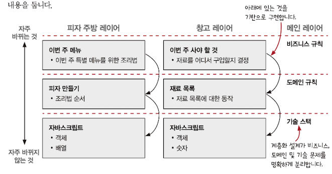

# 상현
# Chapter 1.

함수형 프로그래밍 정의

- 수학 함수를 사용하고 부수 효과를 피하는 것이 특징인 프로그래밍 패러다임
- 부수효과 없이 순수 함수만 사용하는 프로그래밍 스타일

함수형은 학문적으로 많이 연구되었지만 실용적으로 활용하기에 문제가 존재하는데….

- 부수효과는 필요로 한다. 왜냐하면 소프트웨어 동작에 부수 효과는 필요
- 항상 부수효과를 피하고 순수 함수만 사용해야 할 것 같지만, 실제는 부수효과 순수하지 않은 함수를 사용
- 함수형은 실용적으로 활용 가능하지 않다고 판단하지만 가능

**함수형은 액션, 계산, 데이터로 구분**

| name | 호출 횟수 & 호출 시점 | 실행 | 특징 | 예 |
| --- | --- | --- | --- | --- |
| 액션 | 중요. 따라서 부를 때 조심 | 실행 가능 | 시간에 의존하기에 사용 난이도 존재 | sendEmail, saveUserDB |
| 계산 | X | 실행 가능 | 입력값을 출력값으로 전환
언제 어디서 계산해도 결과 동일 | sum, subtract |
| 데이터 | X | 실행 불가 | 이벤트에 대해 기록한 사실 | [1, 2], {name: ‘Ian’} |

함수형 프로그래머는 액션보다 계산을 좋아하고 계산보다 데이터를 선호

(P.45)시간에 따라 바뀌는 값 ⇒ 실행 시점 또는 횟수를 줄이고 데이터와 계산으로 바꿀 수록 문제 해결 상승

**함수형 사고(책의 주제): 함수형 프로그래밍의 기술과 개념**

두 가지 개념

1. 액션, 계산, 데이터를 구분해서 생각
2. 일급 추상(first-class abstraction)

# Chapter 2. 현실에서 함수형 사고

**계층형 설계(stratified design)**: 비즈니스 규칙, 도메인 규칙, 기술 스택 계층(뒤로 갈수록 하위이며 바꾸기 힘듦)

# Chapter 3. 액션과 계산 데이터의 차이를 알기

|name | 액션 | 데이터 | 계산|
|---|---| ----| ----|
|정의|외부 세계에 영향을 주거나 받는 것| 입력값으로 출력값을 만드는 것. 실행 시점과 횟수에 관계없이 같은 입력 ⇒ 같은 출력 | 이벤트에 대한 사실 및 일어난 일의 결과물|

| name | 액션 | 계산 | 데이터 |
| --- | --- | --- | --- |
| 정의 | 외부 세계에 영향을 주거나 받는 것 | 입력값으로 출력값을 만드는 것. 실행 시점과 횟수에 관계없이 같은 입력 ⇒ 같은 출력 | 이벤트에 대한 사실 및 일어난 일의 결과물 |
| 호출 횟수 & 호출 시점 | 중요. 따라서 부를 때 조심 | (중요 X)항상 입력에 대한 출력이 동일 | (중요 X) 데이터 형태를 보관 |
| 특징 | 액션을 부르는 함수가 있다면 그 함수도 액션이 된다 | 액션보다 테스트 및 조합하기 쉬움 | 불변성:  카피-온-라이트, 방어적 복사. 장점(P37): 자유로운 해석, 동일성 비교, 함수는 어려움. 직렬화 가능 |
| 별칭 | 부수효과 | 순수함수: 2 + 3 = 5이기에 5로 바꾸고 다중호출 해도 문제가 없는 것.(P36 결정과 계획이 계산으로 생각될 수 있음) | 없음 |
| 실행 여부 | X | 실행 가능 | 입력값을 출력값으로 전환. 언제 어디서 계산해도 결과 동일 |
| 코드 예시 | sendEmail, saveUserDB, ajax 요청 | sum, subtract, max | [1, 2], {name: ‘Ian’} 

- 문제 생각 시, 현재 문제를 액션, 계산, 데이터로 나눠보기
- 코딩할 때, 액션에서 계산을 분리 및 계산에서 데이터 분리. 액션이 계산 혹은 계산이 데이터로 변경
- 코드를 읽을 때 액션, 계산, 데이터 중 어떤 것에 속하는 지 파악

이메일 목록 계획하기가 왜 액션? 계산 아닌가? 실행시점마다 달라지는데
왜냐하면 데이터베이스에서 구독자 목록을 가져오는데 실행 시점마다 다르기에 액션이라고 함

## 발표 내용

최근 “읽기 쉬운 코드”라는 책을 속독을 했고 “함수형 프로그래밍”에 대한 언급이 있었고 이 기회에 한번 탐색.

### 함수형은 단순화에 대한 출발점?

위 “읽기 쉬운 코드”라는 책을 읽으면서 다음과 같은 문구를 발견

> 전통적인 객체 지향 프로그래밍에서 해결하기 어려운 많은 것들이 함수형 프로그래밍에서는 단순하게 해결할 수 있다는 것이 밝혀졌기 때문입니다
> 
- “전통적인 방법”으로는 의존성 주입, 순수 함수 작성 대신 ‘모의 객체(mock object) 라이브러리” 개발 등등

> 함수형 프로그래밍은 쉽게 읽히고, 이해하기 쉽습니다.
> 
- [특정 글](https://careerfoundry.com/en/blog/web-development/functional-programming-vs-oop/)에서는 반대로 객체지향이 쉽게 읽힌다는 것을 장점으로 보고 있기에 시선에 따라서 다름

위 두 내용을 봤을 때, 기존 객체지향 프로그래밍의 단점을 상당히 보완하기 위해 만들어진 패러다임이라고 느껴지고 gpt를 통해서도 동일한 답변이 유추되는 것을 확인.

[ChatGPT](https://chatgpt.com/share/b15d8f64-e1b3-4713-9616-3166210d0c69)

1. 상태 관리와 부작용: 
    1. 객체지향: 객체 지향의 데이터 변경은 복잡한 상호작용으로 인해 디버깅과 유지보수가 어려움
    2. 함수형: 불변성 데이터를 사용하여 코드 예측 가능성과 디버깅 테스트가 쉬워짐
2. 병렬 처리와 동시성: 
    1. 객체지향: 공유 자원을 접근하는 경우 동기화 문제발생
    2. 함수형: 상태를 공유하지 않기 때문에 병렬 처리와 동시성 문제를 더 쉽게 다룰 수 있어. 불변성과 순수 함수 덕분에 여러 스레드가 동일한 데이터를 동시에 읽어도 문제가 생기지 않기 때문에 멀티코어 프로세서의 성능을 최대로 활용
        1. 현재 회사에서 블록체인 코드는 전부 함수형 패러다임을 기반으로 코드가 작성이 되어 있고, 채택한 이유 또한 동시성에 ㅁㄴㅇ
3. 모듈성과 재사용성: 
    1. 객체지향: 클래스와 객체의 계층 구조를 통해 모듈성을 제공하지만, 상속이나 다형성 때문에 코드의 복잡도가 증가
    2. 함수형: 작은 단위의 순수 함수들을 조합하는 방식을 선호해. 이 함수들은 독립적이고, 재사용이 쉬워서 코드의 모듈성과 유지보수성이 높아져

그러나 많은 글들이 이야기 하듯이 무엇 하나가 월등히 뛰어나기 보다 상호 보완적인 개념 또는 상황에 따라 사용하는 것이 좋다고 가이드.

## 셸 패턴(imperative pattern)

간단 요약:

- 비즈니스 로직은 순수 함수로서 코어에 위치하게 둔다. 또한 외부에 의존성을 가지지 않는다
- 그 외 함수는 밖으로 분류하고, 오직 infra에서 core만 호출 가능하고 그 반대는 불가능